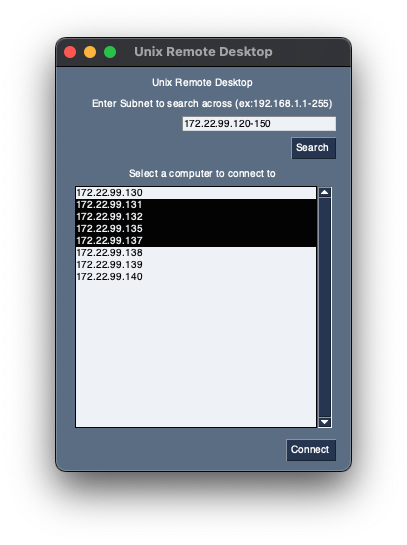

# Unix-Remote-Desktop
A simple applet to send ssh commands to multiple computers at once through ssh.

## Use
1. install python3
2. install python3-tk
3. install the required packages with `pip3 install -r requirements.txt`
4. run the app with `python3 main.py`

## Features
- send commands to multiple computers at once
- remember credentials that were successfully used on the last computer
- ssh password authentication (no key support yet)